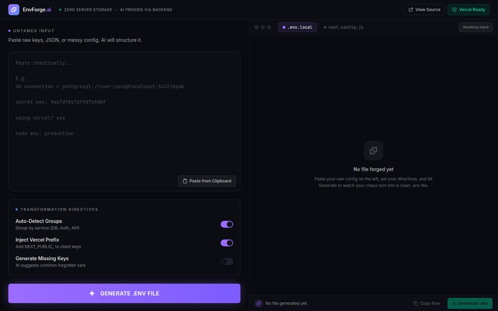
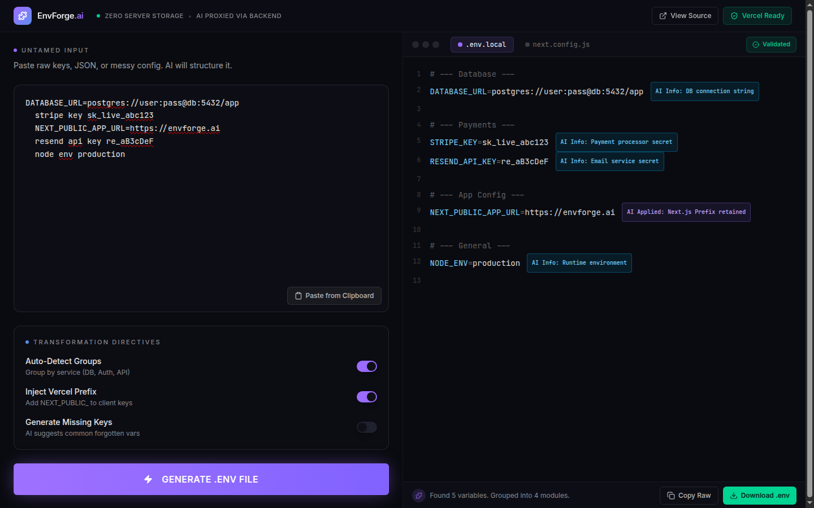

<div align="center">

# 🧩 EnvForge.ai

### Turn chaotic config into production-ready `.env` files — powered by AI

Paste raw keys, JSON, prose, or messy notes. EnvForge.ai parses, groups, and formats them into a clean, Vercel-ready environment file with inline AI annotations.

[](https://react.dev)
[](https://vite.dev)
[](https://expressjs.com)
[](https://openrouter.ai)
[](https://vercel.com)

</div>

---

## ✨ What it does

You paste any messy configuration — copy-pasted Slack messages, JSON dumps, half-formatted notes — and EnvForge.ai turns it into a clean `.env.local` with:

- **Auto-detected sections** (Database, Auth, API Keys, App Config, …)
- **Vercel `NEXT_PUBLIC_` prefix** injected only for client-safe variables
- **Inline AI annotations** explaining what was applied or why a value looks suspicious
- **One-click copy / download** — the file never persists on the server

## 📸 Screenshots

### Empty state — paste your chaos on the left



### Generated output — clean, grouped, annotated



## 🛡️ Privacy model

- **Zero server-side storage.** Submitted text is forwarded once to the AI provider and forgotten — no database, no logs of payloads.
- **API key stays on the server.** The OpenRouter key lives in a server-side environment variable. It is never sent to the browser.
- **Backend proxy.** The browser talks to your own server, which talks to OpenRouter. No CORS keys leaking, no third-party JS calls from the client.

> ⚠️ Honesty note: your raw text **is** transmitted to OpenRouter for the AI step. We don't pretend otherwise. If you need fully local processing, run a local model and swap the proxy.

## 🧱 Architecture

```
┌──────────────────┐     POST /api/ai/generate-env     ┌──────────────────┐
│  React + Vite    │  ───────────────────────────────► │   Express API    │
│  (env-generator) │                                   │   (api-server)   │
└──────────────────┘                                   └────────┬─────────┘
                                                                │
                                                                │  Bearer ${OPENROUTER_API_KEY}
                                                                ▼
                                                       ┌──────────────────┐
                                                       │   OpenRouter     │
                                                       │  (free models)   │
                                                       └──────────────────┘
```

The server tries a chain of free OpenRouter models in order and falls back automatically when one is rate-limited or unavailable:

1. `openai/gpt-oss-120b:free`
2. `z-ai/glm-4.5-air:free`
3. `qwen/qwen3-coder:free`
4. `google/gemma-3-27b-it:free`

## 📁 Repo layout (pnpm monorepo)

```
artifacts/
├── env-generator/     # React + Vite frontend (the UI)
├── api-server/        # Express 5 backend (AI proxy)
└── mockup-sandbox/    # Component preview playground
packages/              # shared workspace libraries
```

## 🚀 Run locally

### Prerequisites
- **Node.js 24+**
- **pnpm 9+**
- **OpenRouter API key** — free tier works ([get one here](https://openrouter.ai/keys))

### Setup

```bash
# 1. Install dependencies
pnpm install

# 2. Set the OpenRouter key (any of these work)
export OPENROUTER_API_KEY="sk-or-v1-..."
# or create artifacts/api-server/.env with: OPENROUTER_API_KEY=sk-or-v1-...

# 3. Start the API server
pnpm --filter @workspace/api-server run dev

# 4. In another terminal, start the frontend
pnpm --filter @workspace/env-generator run dev
```

The frontend will be available at the URL Vite prints (typically `http://localhost:5173`). The API runs on port `8080`.

## 🔧 API contract

**`POST /api/ai/generate-env`**

```jsonc
// Request
{
  "rawText": "db connection = postgres://...\nstripe key sk_live_...\nnode env production",
  "directives": {
    "autoDetectGroups": true,
    "injectVercelPrefix": true,
    "generateMissingKeys": false
  }
}

// Response
{
  "envContent": "# --- Database ---\nDATABASE_URL=postgres://...\n\n# --- Payments ---\nSTRIPE_KEY=sk_live_...\n",
  "annotations": [
    { "key": "DATABASE_URL", "label": "AI Info: DB connection string", "type": "info" },
    { "key": "NEXT_PUBLIC_APP_URL", "label": "AI Applied: Next.js Prefix retained", "type": "applied" }
  ],
  "summary": "Found 5 variables. Grouped into 4 modules.",
  "moduleCount": 4
}
```

## 🛠️ Tech stack

| Layer       | Choice                                     |
| ----------- | ------------------------------------------ |
| Frontend    | React 19 + Vite 7 + Tailwind + shadcn/ui   |
| Icons       | lucide-react                               |
| Backend     | Express 5 + Pino logger                    |
| AI          | OpenRouter (free-tier model fallback chain)|
| Monorepo    | pnpm workspaces                            |
| Build       | esbuild (server) / Vite (client)           |

## ☁️ Deploy to Vercel

This repo is **Vercel-ready out of the box**. The `api/ai/generate-env.ts` Edge Function mirrors the local Express route, so the same React frontend works in both environments.

[](https://vercel.com/new/clone?repository-url=https%3A%2F%2Fgithub.com%2FYOUR_USERNAME%2FYOUR_REPO&env=OPENROUTER_API_KEY&envDescription=Get%20a%20free%20key%20from%20openrouter.ai%2Fkeys&envLink=https%3A%2F%2Fopenrouter.ai%2Fkeys&project-name=envforge-ai&repository-name=envforge-ai)

### Manual deploy

```bash
# 1. Install the Vercel CLI (once)
npm i -g vercel

# 2. From the repo root
vercel link        # link to a new or existing project
vercel env add OPENROUTER_API_KEY    # paste your key (Production + Preview + Development)
vercel --prod      # ship it
```

That's it. Vercel will:
1. Run `pnpm install --frozen-lockfile`
2. Build the React app via `pnpm --filter @workspace/env-generator run build`
3. Serve the static output from `artifacts/env-generator/dist/public`
4. Deploy `api/ai/generate-env.ts` as an Edge Function at `/api/ai/generate-env`

All of this is wired up in [`vercel.json`](./vercel.json) and [`.vercelignore`](./.vercelignore).

### Required environment variable

| Name                 | Where to set                | Description                                 |
| -------------------- | --------------------------- | ------------------------------------------- |
| `OPENROUTER_API_KEY` | Vercel → Project → Settings | Your OpenRouter API key (free tier is fine) |

### Local Vercel preview

```bash
vercel dev   # runs the same Edge function locally on http://localhost:3000
```

> 💡 Even though this repo uses pnpm workspaces, the only files Vercel actually deploys are the built frontend + the `api/` folder. The Express server (`artifacts/api-server`) is **excluded** via `.vercelignore` — it's only used for local Replit development.

## 🤝 Contributing

PRs welcome — especially for:
- Additional transformation directives (e.g. "Suggest validators", "Detect production-vs-dev keys")
- Multi-file output (`.env.local` + `.env.example` + `next.config.js`)
- Schema validation of the AI response with Zod

## 📜 License

MIT — do whatever you want with it.

---

<div align="center">

Built with AI on [Likya](https://www.likya.digital)

</div>
